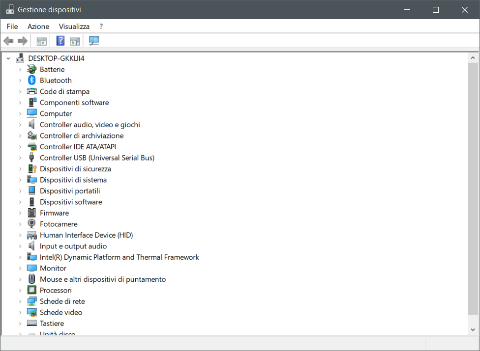
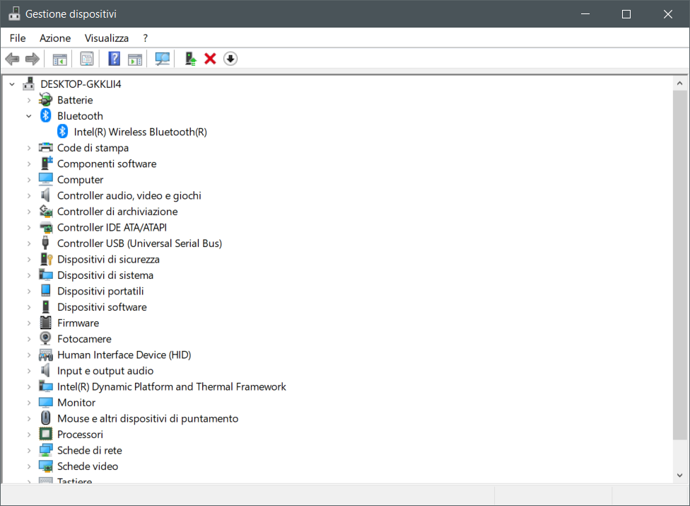
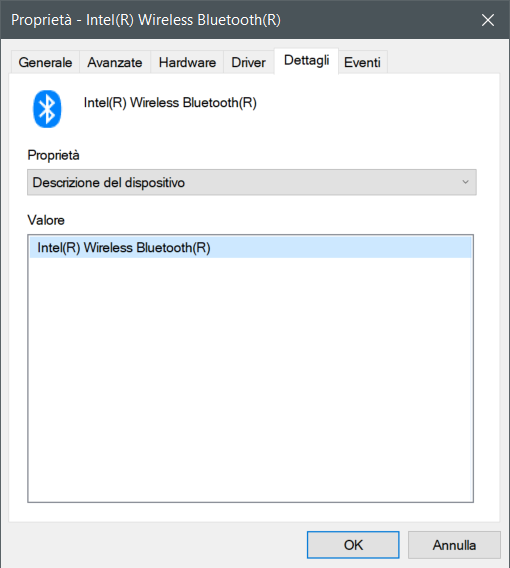
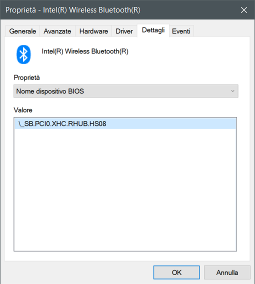

# Disabling unsupported BT chip

## Marcello, what is it?

The following guide is supposed to help users for disabling unsupported Bluetooth chip

## What you doin'?

Disabling bluetooth chip on my hackintosh

## Mammamia Marcello, this is not how to disable it on hackintosh

What you mean?

## This is how to disable unsupported BT chip

## Requirements

* `ACPI Path` of Bluetooth device

Usually, Bluetooth card is connected via a USB bus. This means that it will have an ACPI path such as `\_SB.PCI0.XHC_.RHUB.HSxx` . Let's start!

### Step 1: identify the ACPI path

On Windows ACPI path can be easily discovered using `Device Manager` . Open it and expand Bluetooth section as depicted below:





Right click on `Intel(R) Wireless Bluetooth(R)` and click on `Information`:





As said before the ACPI path is `\_SB.PCI0.XHC.RHUB.HS08`. Remember this path and let's shut down the device in our SSDT.


**NOTE: the following step is optional.**

This procedure is same as [USB Mapping for Intel](../../usb/mapping/intel.md) chipset. You can skip directly to the linked guide or write a custom 


### Step 2: write a disabler SSDT for BT

Open MaciASL and create a new file containing the following code:

```text
DefinitionBlock ("SSDT-BT_disabler", "SSDT", 2, "INTEL", "BT_OFF", 0x00000000)
{
    External (_SB_.PCI0.XHC_.RHUB, DeviceObj)
    External (_SB_.PCI0.XHC_.RHUB.GUPC, MethodObj)
    External (_SB_.PCI0.XHC_.RHUB.HS08._UPC, MethodObj) 
    Method (\_SB.PCI0.XHC.RHUB.HS08._UPC)
    {
        Method (_UPC, 0, NotSerialized)  // _UPC: USB Port Capabilities
        {
            Return (GUPC (Zero))
        }
    }  
}

```


Change **\_SB.PCI0.XHC\_.RHUB.HS08** with the previously found ACPI path


Compile the SSDT and save it in `ECAP` folder.


