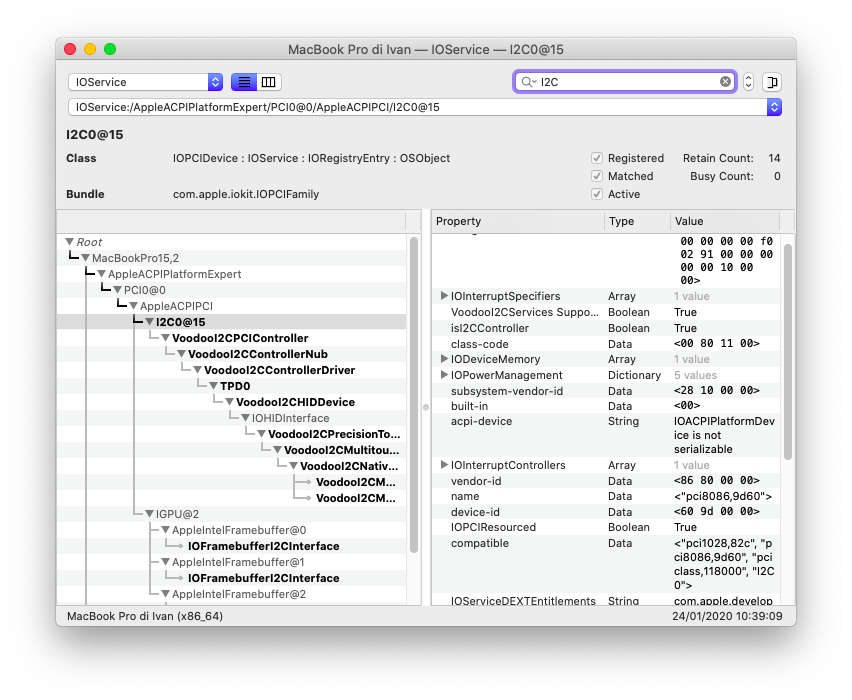
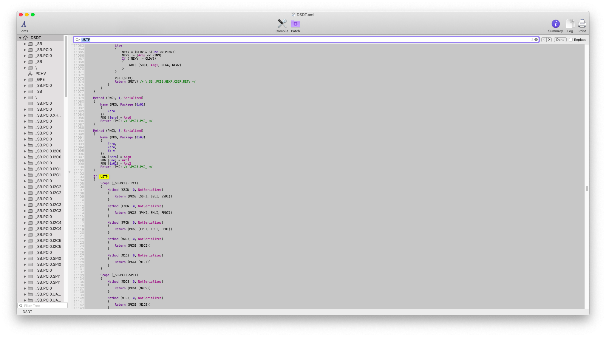
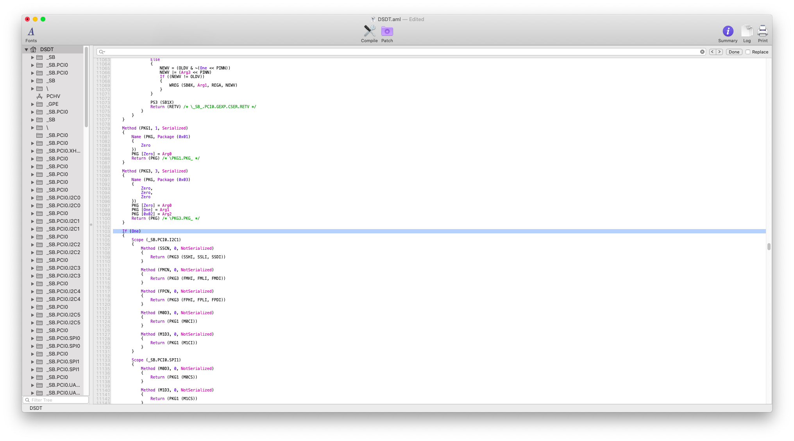
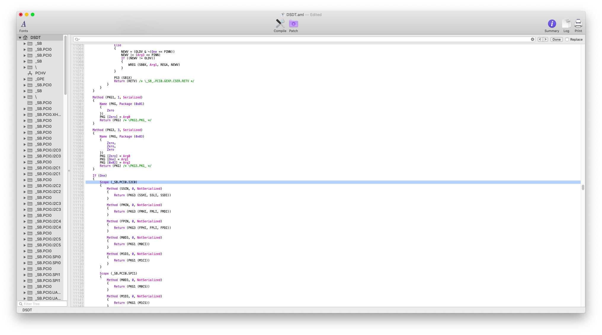
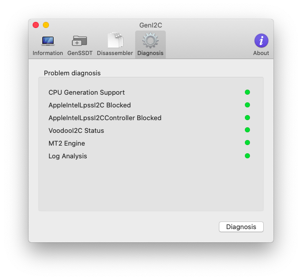

# Fixes

## Trackpad is unresponsive and no trackpad preference panel in System Preferences

## Missing SSCN or FMCN bus speed config

`SSCN` and `FMCN` contain information about the I2C bus. Those values depends by the hardware and need to be fixed by hand.

Open GenI2C, Diagnosis section

### Requirements

* Clover Configurator
* MaciASL
* IORegistryExplorer

### Steps

1. Open IORegistryExplorer
2. [Mount EFI](../../bootloaders/mount-efi.md)
3. Navigate to /Volumes/EFI/EFI/CLOVER/ACPI/patched
4. Open DSDT.aml with MaciASL

`TPD0` attaches to `I2C0`. Remember it

Change `USTP` to `One` as depicted in the following screenshot

Change `I2C1` to `I2C0`

Save and reboot and test again with GenI2C diagnosis section

It should be as depicted in the following screenshot

## Kernel PANIC after resuming from long sleep

It can occur sometimes that after resuming from sleep, you will get a `Problem Report for macOS` related to `com.alexandredVoodooI2CHID`.

After digging up on Google & Co, finally I've found a working solution on VoodooI2C [Issue \#192](https://github.com/alexandred/VoodooI2C/issues/192#issuecomment-546703371)

After opening `VoodooI2CHID.kext/Contents/Info.plist` with any .plist editor, I've set up `QuietTimeAfterTyping` to `0`.

 

