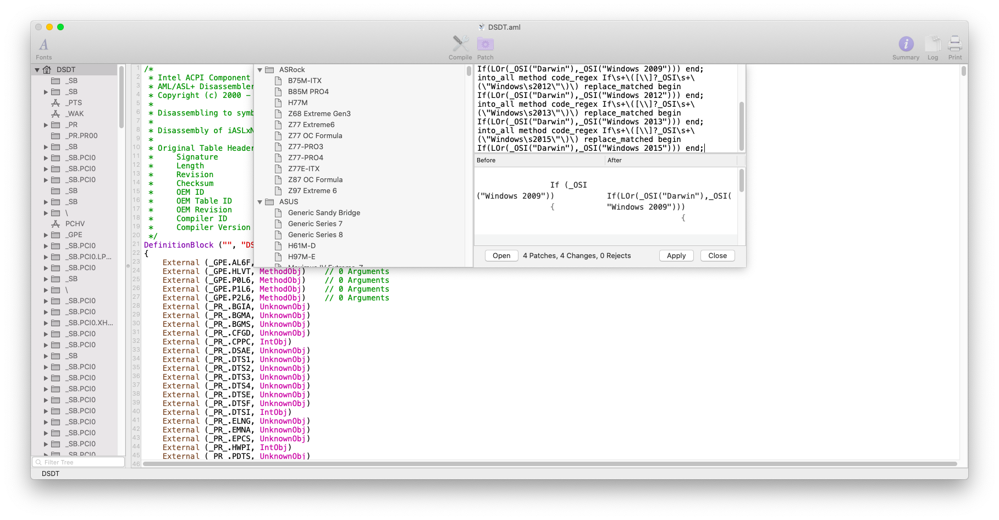

# Intel


**Q:** Can this procedure break my hackintosh?  
**A:** The following procedure is safe your hackintosh. Just fix the ACPI errors.


##  Requirements

* SSDT-USB.aml
* *  [Extracting ACPI tables](../../acpi/extracting-acpi-tables.md)
* MaciASL
* Hackintool
* Clover Configurator
* IORegistryExplorer
* [USBInjectAll](../../installation/kexts/usb/usbinjectall.md#download-link)

## Step 1: Installing the kext

[Mount EFI](../../bootloaders/mount-efi.md) and place in `/Volumes/EFI/EFI/CLOVER/kexts/Other` **USBInjectAll.kext**


## Step 2: extract ACPI Tables



## Step 3: identify the SSDT which defines USB ports

From Intel Haswell generation onwards, USB ports are no more defined inside `DSDT.aml` but in an SSDT table.

On my machine, USB ports are defined inside `SSDT-2-xh_OEMBD.aml`. Just open every single `SSDT.aml` with MaciASL and look for a tree like depicted in the following screenshot

 


## Step 4: identify which port is active or not

Open Hackintool and go in USB section


Click on the Clear button \(the third button from left\)


Then click on Refresh button


Finally connect a USB 2.0 in each port and note the `Name` of the USB port \(e.g. HS01 for USB3.0 etc.\)  
Then remove any port that isn't highlighted with the second button.  
  
You should have a result like the depicted one below

 


## Step 5: setup the ports inside SSDT

Open the previously identified SSDT with MaciASL  


According to [Advanced Configuration and Power Interface \(ACPI\) Specification, version 6.3](https://uefi.org/sites/default/files/resources/ACPI_6_3_May16.pdf), page [673](https://uefi.org/sites/default/files/resources/ACPI_6_3_May16.pdf#page=673), `_UPC` method return the following Package:

```text
Return Value Information:
Package {
 Connectable // Integer (BYTE)
Type // Integer (BYTE)
 Reserved0 // Integer
 Reserved1 // Integer)
}
```

| Parameter | Values | Explanation |
| :--- | :--- | :--- |
| **Connectable** | Zero/One | Disabled port/Enabled port |
| **Type** | table below | Specifies the host connector type |

| Hex | USB Type |
| :--- | :--- |
| 0x00 | Type ‘A’ connector |
| 0x01 | Mini-AB connector |
| 0x02 | ExpressCard |
| 0x03 | USB 3 Standard-A connector |
| 0x04 | USB 3 Standard-B connector |
| 0x05 | USB 3 Micro-B connector |
| 0x06 | USB 3 Micro-AB connector |
| 0x07 | USB 3 Power-B connector |
| 0x08 | Type C connector - USB2-only |
| 0x09 | Type C connector - USB2 and SS with Switch |
| 0x0A | Type C connector - USB2 and SS without Switch |
| 0x0B-0xFE | Reserved |
| 0xFF | Proprietary connector |

Now just look for each port you've discovered before and fill a table like the below one e.g.

| Name | Connector type |
| :--- | :--- |
| HS01 | USB 3 Power-B connector |
| HS03 | Type C connector - USB2 and SS with Switch |
| HS04 | USB 3 Standard-A Connector |
| HS05 | Proprietary connector |
| HS06 | Type ‘A’ connector |
| HS07 | Type ‘A’ connector |
| SS01 | USB 3 Standard-B connector |
| SS04 | USB 3 Standard-A connector |

## Step 6: add the SSDT methods

If you look closely to `GUPC` method, you can see that it assigns for each port the **Connector Type** _**Internal**._ We need to copy this method for defining the behaviour of USB2, USB3 and USB3 powered ports.

Just add those methods:

```text
        Method (USB2, 1, Serialized)
        {
            Name (PCKG, Package (0x04)
            {
                Zero, 
                0x00, //Proprietary connector aka USB2
                Zero, 
                Zero
            })
            PCKG [Zero] = Arg0
            Return (PCKG) /* \_SB_.PCI0.XHC_.RHUB.USB2.PCKG */
        }

        Method (USB3, 1, Serialized)
        {
            Name (PCKG, Package (0x04)
            {
                Zero, 
                0x03, //USB3 connector not powered
                Zero, 
                Zero
            })
            PCKG [Zero] = Arg0
            Return (PCKG) /* \_SB_.PCI0.XHC_.RHUB.USB3.PCKG */
        }

        Method (SB3P, 1, Serialized)
        {
            Name (PCKG, Package (0x04)
            {
                Zero, 
                0x07, //USB3 connector powered 
                Zero, 
                Zero
            })
            PCKG [Zero] = Arg0
            Return (PCKG) /* \_SB_.PCI0.XHC_.RHUB.SB3P.PCKG */
        }

```

Add those methods and replace GUPC with the port type that we've discovered previously

Look at the figure below


Save SSDT in `/Volumes/EFI/EFI/CLOVER/ACPI/patched` __and reboot

Repeat **Step 4** and you should see something like the depicted one below



Enjoy your USB ports mapped

## Credits

* [Olarila Native USB FIX for desktop ](https://olarila.com/forum/viewtopic.php?f=28&t=10171)
  * it's valid also for laptops :\)


 


